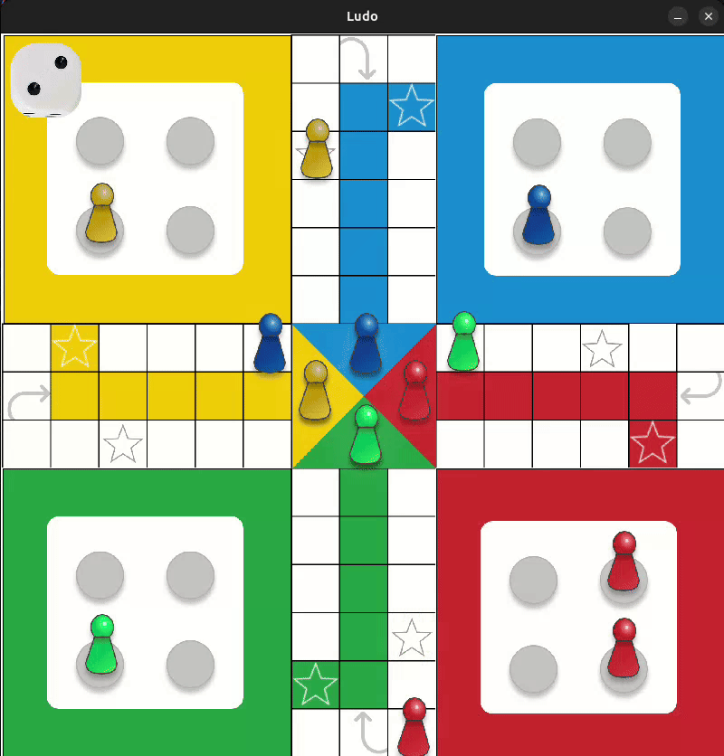

## PettingZoo Ludo Environment

**PettingZoo-Ludo** is a turn-based multi-agent version of **Ludo** built on the PettingZoo AEC API and Gymnasium.  
It supports 2–4 players in either single or fixed 2v2 teams.

**Features**: Dice banking (agents explicitly choose which die to use), three-sixes penalty, extra turns from finishing/capturing/rolling 6, and dense reward shaping. See `train/README.md` for training examples.



---

## Install

```bash
git clone https://github.com/Sim43/PettingZoo-Ludo.git
cd PettingZoo-Ludo
pip install -e .
```

---

## Quick commands

- **Create the environment in Python**:

```python
from ludo import env
env = env(mode="single")  # or mode="teams"
```

- **Run API/compliance tests**:

```bash
pytest tests/test_ludo_compliance.py
```

- **Run a simple render test**:

```bash
pytest tests/test_render.py
```

- **Quick random play loop with rendering** (Python shell or script):

```python
from ludo import env
e = env(render_mode="human")
e.reset()
for agent in e.agent_iter():
    obs, rew, term, trunc, info = e.last()
    if term or trunc:
        e.step(None)
        continue
    # Action space: Discrete(65) = (piece, die_index) pairs + PASS
    action = int(info["action_mask"].argmax())  # simple legal action
    e.step(action)
```

For the Ludo rules implemented here (capture requirement, safe squares, team blocks, three-sixes rule), see `LUDO_RULES.md`.

---

## Reward structure (summary)

| **Category**             | **Trigger**                                           | **Reward (single)**                                         | **Reward (Teams)**                                  |
|-------------------------|-------------------------------------------------------|----------------------------------------------------------|-----------------------------------------------------|
| Terminal rank           | Finish 1st / 2nd / 3rd / 4th                          | +1.00 / +0.30 / −0.30 / −1.00                            | Winning team: +1 each, losing team: −1 each        |
| Capture (shaping)       | You capture an enemy piece                            | +0.02 / +0.03 / +0.06 / +0.08 (by enemy progress, capped at +0.25 per opponent/episode) | Same                                                |
| Got captured (penalty)  | One of your pieces is captured                        | −0.02 / −0.03 / −0.06 / −0.08 (by your progress)         | Same                                                |
| Finish a piece          | A piece reaches its final home position               | +0.10, +0.08, +0.06, +0.04 (per colour, 1st–4th piece)   | Same                                                |
| Leave yard (shaping)    | Leave yard while you already have ≥1 active piece and the move is not forced | +0.02                                  | Same                                                |
| Threat-aware exposure   | After your move, a piece is capturable next enemy turn (not on safe) | Up to about −0.08, scaled by risk and progress          | Same                                                |
| Loop-waste              | Piece completes a full loop before any capture for that colour | −0.20 per wasted loop per piece                          | Same                                                |
| Illegal move            | Action outside the legal action mask                  | −1 for acting agent (via wrapper)                        | Same                                                |

---

## License

This project is licensed under the terms in `LICENSE` (MIT).***